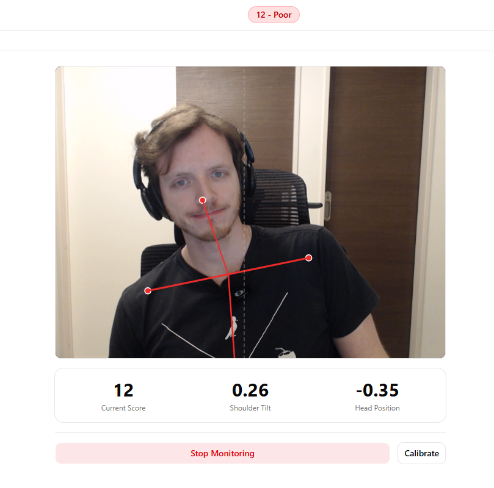
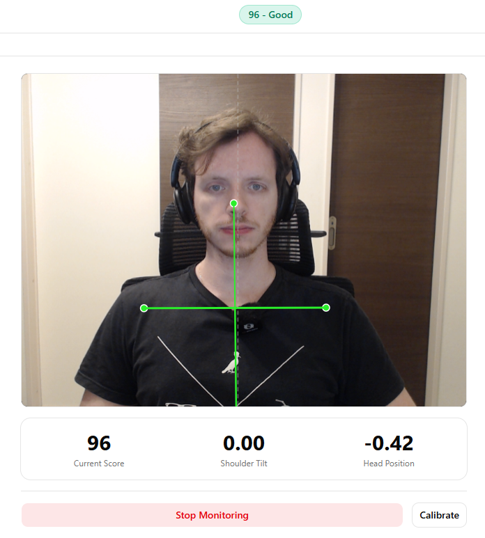

# Posture Monitor

A desktop app that monitors your posture in real time using your webcam. It detects body landmarks via MediaPipe, scores your posture from 0 to 100, and notifies you when you start slouching. All processing happens locally — no data leaves your machine.

<p align="center">
  
  
</p>

## Features

- **Real-time posture scoring** — Continuously analyzes your pose via webcam and displays a 0–100 score
- **Visual feedback** — Skeleton overlay turns green for good posture, red for poor posture
- **Desktop notifications** — Alerts you when your posture drops below your configured threshold
- **Calibration** — Auto-calibrates to your natural sitting position, with manual calibration option
- **Session tracking** — Records sessions with score history and statistics over time
- **Adjustable sensitivity** — Tune how strictly the app judges your posture
- **Privacy-first** — Everything runs locally. Camera feed is never transmitted or stored. Data lives in a local SQLite database

## Tech Stack

- [Tauri v2](https://v2.tauri.app/) (Rust backend)
- [React 19](https://react.dev/) + TypeScript
- [MediaPipe Pose Landmarker](https://ai.google.dev/edge/mediapipe/solutions/vision/pose_landmarker)
- SQLite via [tauri-plugin-sql](https://v2.tauri.app/plugin/sql/)
- [Tailwind CSS](https://tailwindcss.com/) + [shadcn/ui](https://ui.shadcn.com/)
- [Vite](https://vite.dev/)

## Prerequisites

- [Node.js](https://nodejs.org/) (v18+)
- [Rust](https://www.rust-lang.org/tools/install)
- [Tauri v2 prerequisites](https://v2.tauri.app/start/prerequisites/)

## Getting Started

```bash
# Clone the repository
git clone https://github.com/gustavostz/posture-cam.git
cd posture-cam

# Install dependencies
npm install

# Run in development mode
npm run tauri dev

# Build for production
npm run tauri build
```

## Usage

1. Allow camera access when prompted
2. Sit in your normal upright position — the app auto-calibrates during the first few seconds
3. Click **Start Monitoring** to begin tracking
4. The score and skeleton overlay update in real time
5. You'll receive a desktop notification if your posture drops below the threshold

## License

MIT
