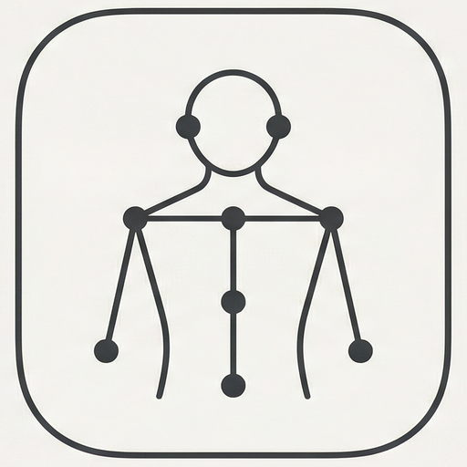
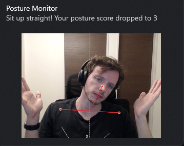

<p align="center">
  
</p>

<h1 align="center">Posture Cam</h1>

<p align="center">
  A privacy-first desktop app that monitors your posture in real time using your webcam.<br>
  Detects body landmarks via MediaPipe, scores your posture from 0 to 100,<br>
  and notifies you when you start slouching. All processing happens locally.
</p>

<p align="center">
  <a href="https://github.com/gustavostz/posture-cam/releases/latest"></a>
  <a href="https://github.com/gustavostz/posture-cam/releases"></a>
  <a href="https://github.com/gustavostz/posture-cam/actions/workflows/release.yml"></a>
  <a href="LICENSE"></a>
</p>

---

## 🖥️ Screenshots

<p align="center">
  
  <br><em>Bad posture detected — desktop notification with screenshot</em>
</p>

<p align="center">
  
  <br><em>Good posture — skeleton overlay turns green</em>
</p>

---

## ✨ Features

- 📊 **Real-time posture scoring** — Continuously analyzes your pose via webcam and displays a 0–100 score
- 🦴 **Visual feedback** — Skeleton overlay turns green for good posture, red for poor posture
- 🔔 **Desktop notifications** — Alerts you when your posture drops below your configured threshold
- 🎯 **Calibration** — Auto-calibrates to your natural sitting position, with manual calibration option
- 📈 **Session tracking** — Records sessions with score history and statistics over time
- ⚙️ **Adjustable sensitivity** — Tune how strictly the app judges your posture
- 🔒 **Privacy-first** — Everything runs locally. Camera feed is never transmitted or stored

---

## 📥 Download

Download the latest version for your platform:

| Platform | Formats | Link |
| :---: | :---: | :---: |
| 💻 **Windows** | `.exe`, `.msi` | [**Download**](https://github.com/gustavostz/posture-cam/releases/latest) |
| 🍎 **macOS** | `.dmg` (Apple Silicon & Intel) | [**Download**](https://github.com/gustavostz/posture-cam/releases/latest) |
| 🐧 **Linux** | `.deb`, `.rpm`, `.AppImage` | [**Download**](https://github.com/gustavostz/posture-cam/releases/latest) |

---

## 🚀 Usage

1. Download and install for your platform
2. Allow camera access when prompted
3. Sit in your normal upright position — the app auto-calibrates during the first few seconds
4. Click **Start Monitoring** to begin tracking
5. The score and skeleton overlay update in real time
6. You'll receive a desktop notification if your posture drops below the threshold

---

## 🛠️ Tech Stack

| Layer | Technology |
| --- | --- |
| **Desktop** | [Tauri v2](https://v2.tauri.app/) (Rust) |
| **Frontend** | [React 19](https://react.dev/) + TypeScript |
| **AI/Vision** | [MediaPipe Pose Landmarker](https://ai.google.dev/edge/mediapipe/solutions/vision/pose_landmarker) |
| **Database** | SQLite via [tauri-plugin-sql](https://v2.tauri.app/plugin/sql/) |
| **Styling** | [Tailwind CSS](https://tailwindcss.com/) + [shadcn/ui](https://ui.shadcn.com/) |
| **Build** | [Vite](https://vite.dev/) |

---

## 👨‍💻 Development

### Prerequisites

- [Node.js](https://nodejs.org/) (v18+)
- [Rust](https://www.rust-lang.org/tools/install)
- [Tauri v2 prerequisites](https://v2.tauri.app/start/prerequisites/)

### Getting Started

```bash
# Clone the repository
git clone https://github.com/gustavostz/posture-cam.git
cd posture-cam

# Install dependencies
npm install

# Run in development mode
npm run tauri dev

# Build for production
npm run tauri build
```

---

## 📜 License

[GPL v3](LICENSE) — free to use and modify. Derivative works must also be open-sourced under GPL v3.
